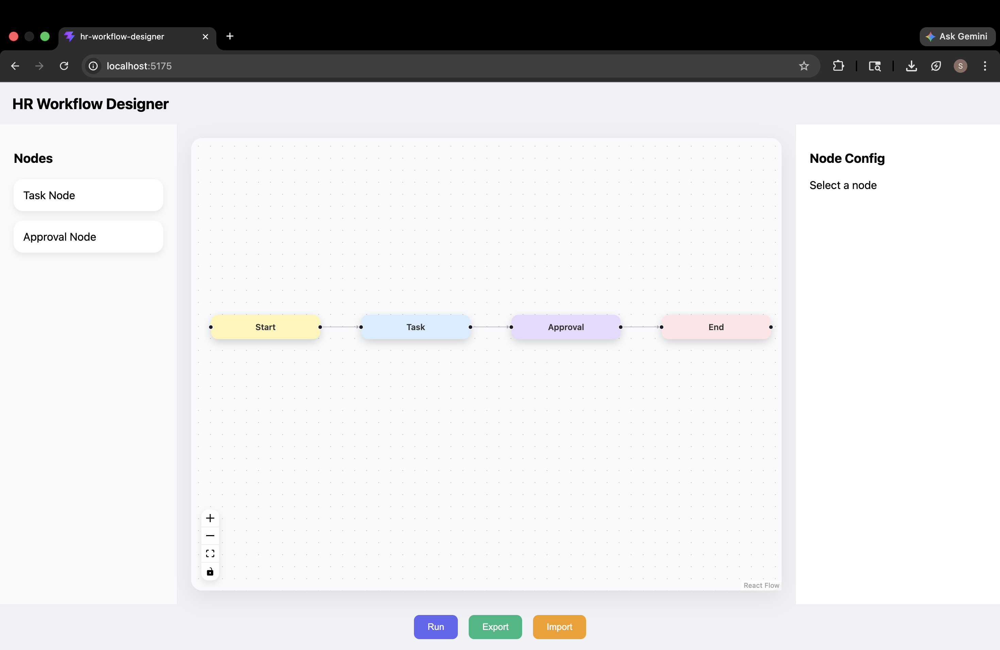
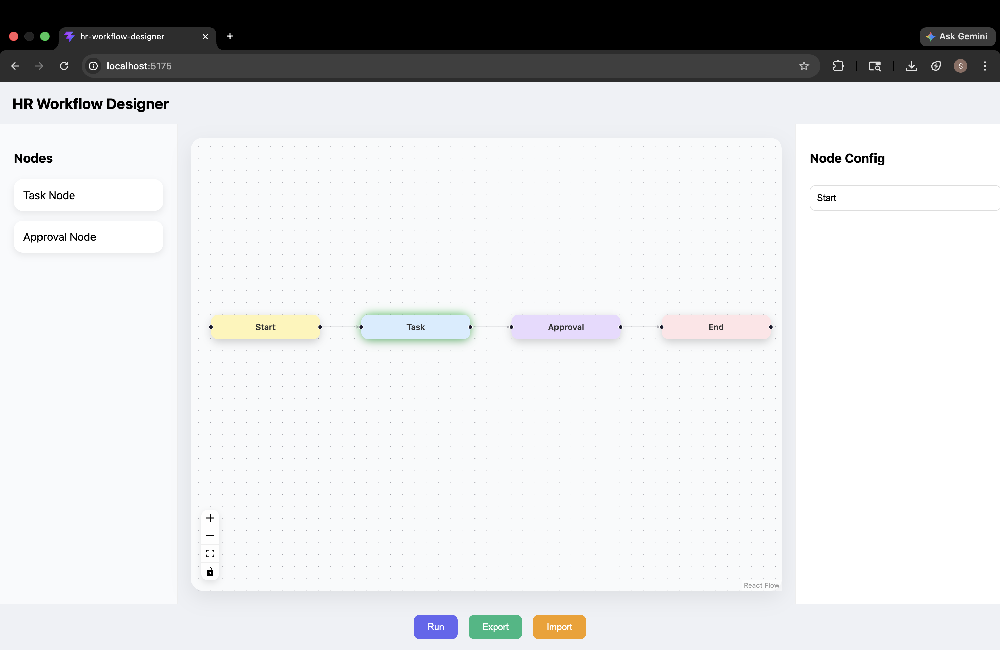
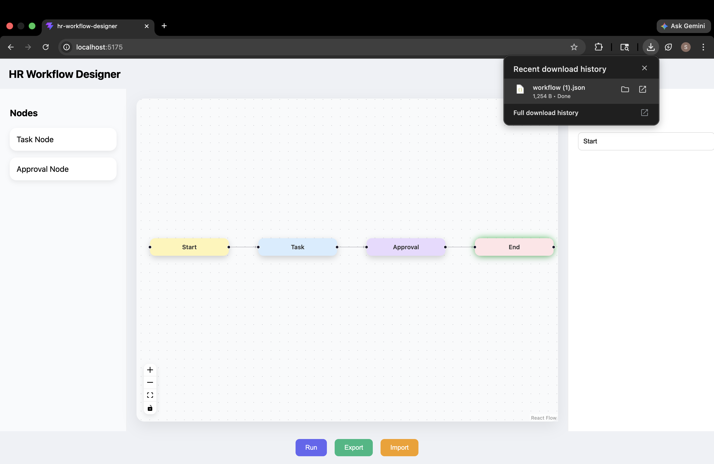

# HR Workflow Designer

HR Workflow Designer is an interactive, node-based workflow builder built using React Flow. It enables users to visually design, connect, and simulate HR processes with real-time execution and JSON import/export capabilities.

---

## Overview

This project provides a visual interface for constructing workflow pipelines commonly used in HR systems. Users can create connections between different stages such as task assignment, approval, and completion, and simulate execution step-by-step.

The application demonstrates how complex processes can be represented using graph-based UI and interactive frontend design.

---

## Features

* Visual workflow creation using connected nodes
* Drag-and-connect functionality for defining flow
* Step-by-step workflow execution (Run Workflow)
* Custom node types:

  * Start
  * Task
  * Approval
  * End
* Approval and rejection flow simulation
* Import workflow from JSON
* Export workflow to JSON
* Interactive node selection and highlighting

---

## Tech Stack

* React
* TypeScript
* React Flow (@xyflow/react)
* Vite
* CSS

---

## Project Structure

```bash
flowforge-hr/
  assets/
    main-ui.png
    run.png
    export.png
  src/
    App.tsx
    Sidebar.tsx
    NodeConfigPanel.tsx
  public/
  README.md
```

---

## Screenshots

### Main UI



### Workflow Execution



### Export Feature



---

## Installation and Setup

Clone the repository:

```bash
git clone https://github.com/saniatanweer29/flowforge-hr.git
cd flowforge-hr
```

Install dependencies:

```bash
npm install
```

Run the development server:

```bash
npm run dev
```

---

## Usage

* Connect nodes by dragging from one node to another
* Click **Run Workflow** to simulate execution
* Observe node highlighting as the workflow progresses
* Use **Export** to download the workflow as JSON
* Use **Import** to load a saved workflow

---

## Future Enhancements

* Auto layout for node positioning
* Advanced conditional branching
* Backend integration for saving workflows
* Role-based workflow control
* Improved node configuration panel

---

## Author

Sania Tanweer

---


